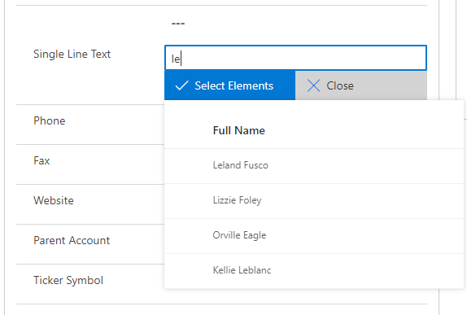

# On Key Press control

## Description

This control has been created in order to select many records from an entity.
What this will do is to insert the data split by the delimiter you have selected in your control in the single text field this is attached.
This can be useful to retrieve a "list of records" from a single field and it can be used in a plugin.

## Download

[DOWNLOAD LATEST RELEASE](https://github.com/victorsolaya/Multiselect_Records_PCF/releases/latest)

## How to configure

1. Add the control to the field that will contain the data split by your delimiter.
2. The parameters of the control are explained below

## Parameters

1. Field -> It is the field that will contain the data
2. Entity Name -> Records from this entity name will be displayed
3. Filter -> Filter to reduce the amount of data that will be displayed in your list. This is explained in the next section.
4. Field Filter Values -> This will behave dynamically for the filter. They ARE REQUIRED to be split by comma (,) This is explained in the next section.
5. Data -> Which field from the entity name selected (2) you want to be set in the field (1)
6. Columns -> To retrieve and display the data you need to set the columns with the following syntax: Display Name, fieldName; Account Name,name
7. Header Visible -> Set if the header will be visible in the list displayed.
8. Delimiter for the exposed data -> This will be the delimiter to split the data in your field (1)

## Filter section

This is a quite important section because this will allow us to not retrieve all the data from an entity.
How it is set is to take a fetchxml or a WebApi query as ?$filter= ...

This has been implemented with parameters. All of our parameters will be set with the following syntax: {1}

- {0} will be the search box input.
This means that if you set in your filter: ?$filter=contains(name,'{0}') everytime you input some text you will be querying against the webapi
This can be used as well in the fetchxml

- {1} {2} are the parameters you set in your Field Filter Values.
This means that if you need to filter your query based on a field in the entity this control is set, you have to add that field in your query.
The Field Filter Values is a Xrm.Webapi call to the record as we have the entityid and the entityname.

### Example

This control is set in the account entity.
We have a control in a single text field that is retrieving contacts.
We want to retrieve the contacts which full name contains our input and the parentcustomerid is the id of the record we are right now.

For that we will put the following parameters:
- Filter -> ?$filter=contains(fullname, '{0}') and _parentcustomerid_value eq {1} and contactcountry eq {2}
- Field Filter Values -> accountid,country

This will filter our contacts with the account we are right now and it will be filtered more when we search in our box.

### Example with two parameters

- Filter -> ?$filter=contains(fullname, '{0}') and _parentcustomerid_value eq {1} and contactcountry eq {2}
- Field Filter Values -> accountid,country

This will filter our contacts with the account we are right now and its country plus it will be filtered more when we search in our box.

## Example of configuration

## Issues / Questions

If you have any questions or issues regarding this control, please, raise an issue in github or send me an email: me@victorsolaya.com

