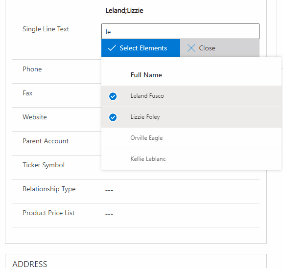

# Multiselect Records

## Description

This control has been created to select many records from an entity.
This will insert a JSON in the field the control is bounded with both id and name. These items are going to be used in order to show the information, and to perform an onClick event to redirect to a form.
This can be useful to retrieve a "list of records".

NOTES: This has been a great step forward from the previous version. If you still want to download the previous one and not this latest one you can clicking in the section [Download Previous Release]

## Improvements

What have been the improvements with the previous version?
- (Visualization) Well, at the very first glance, it is more visual than the previous one. Now, you can navigate to a record instead of displaying some data.

- (Width allocation) It has been set the width of the container, now it will allocate everything between this width. The same as all the items, image will be shown in order to show you this.

- (Better filtering) If you have many records selected, you can filter based on the name so you can check that record is there or you can remove it from your selection. Image will be provided in order to show you this.

- (Removed is mUltiple porperty) Removed Is Multiple property since it wasn't needed for a MULTI selector. 😄

- (Filter tags) Added property to filter the tags

- (Better selection) Selection of the rows will be kept in a bag waiting for your [Select Elements] on click

- (New property maximum elements returned) Now you can add the amount of records as maximum that will be shown when they are retrieved. By default is going to be 50, but you can set as much as you need.

- (React hooks) Changed the React into Hooks! (Some help from developers will be really well received to criticize how bad/good this has been done.)

## Download

[DOWNLOAD LATEST RELEASE](https://github.com/victorsolaya/Multiselect_Records_PCF/releases/latest)

## Download Previous Release

[DOWNLOAD PREVIOUS RELEASE](https://github.com/victorsolaya/Multiselect_Records_PCF/releases/tag/v0.9.53)

## How to configure

1. Add the control to the field that will contain the data split by your delimiter.
2. The parameters of the control are explained below
3. **My suggestion is to bound this control to a Multitext Area since the JSON can be quite long in order to contain everything**

## Parameters

1. Field (required) -> It is the field that will contain the data

2. Entity Name (required) -> Records from this entity name will be displayed

3. Data (required) -> Which field from the entity name selected (2) you want to be shown in the field (1)

4. Attribute Id (required)-> This has to be the main attribute of your entity. **E.g: From account = accountid, from contact = contactid ... This will be used in order to open the record in a new form.**

5. Filter (required) -> Filter to reduce the amount of data that will be displayed in your list. This is explained in the next section.

6. Field Filter Values (optional) -> This will behave dynamically for the filter. They **ARE REQUIRED** to be split by comma (,) This is explained in the next section.

7. Columns (required)-> To retrieve and display the data you need to set the columns with the following syntax: Display Name, fieldName; Account Name,name

8. Header Visible (required)-> Set if the header will be visible in the list displayed.

9. Open Form Options (required) -> This allows you to choose how to open the record when you perform an onClick. Options are: Popup, New Window, Same Window.

10. Populated Field Visible (required)-> Set if the field that gets populated will be visible. **NOTE: As now it is a JSON I would suggest to always set is as False. (It is the first option to appear when you select the dropdown)**

11. Filter tags (required) -> You can set if the tags above will be filtered as well when you type or not.

12. Amount of records to be shown as maximum (optional) -> This will set the amount of records your list will show. By default is going to be 50, but you can set as much as you want.

## Filter section

This is a quite important section because this will allow us to not retrieve all the data from an entity.
How it is set is to take a fetchxml or a WebApi query as ?$filter= ...

This has been implemented with parameters. All of our parameters will be set with the following syntax: {1}

- {0} will be ALWAYS the search box input.
This means that if you set in your filter: ?$filter=contains(name,'{0}') every time you input some text you will be querying against the webapi
This can be used as well in the fetchxml.

      THIS IS QUITE IMPORTANT BECAUSE WILL REDUCE THE NUMBER OF RECORDS THAT ARE GOING TO APPEAR. THE LIST WILL BE SHOWN ONLY WHEN 50 ITEMS ARE RETRIEVED

- {1} / {2} are the parameters you set in your Field Filter Values.
This means that if you need to filter your query based on a field in the entity this control is set, you have to add that field in your query.
The Field Filter Values is a Xrm.Webapi call to the record as we have the entityid and the entityname.

      THESE ARE OPTIONAL, THEY ARE REPRESENTED BY {1}, {2}, THERE IS NO LIMIT, BUT WILL ALWAYS BE REFERENCE TO THE ENTITY YOU ARE RIGHT NOW

#### Notes

Just for your knowledge, the $filter=contains WILL NOT work in the offline mode, this is based on a limitation not written in the API.
There is already an issue open with Microsoft about this. [https://github.com/MicrosoftDocs/dynamics-365-customer-engagement/issues/1916](https://github.com/MicrosoftDocs/dynamics-365-customer-engagement/issues/1916)

### **Basic example with no parameters**

This control is set in the account entity.
We have a control in a single text field that is retrieving contacts.
We want to retrieve the contacts which full name contains our input

For that we will put the following parameters:
- Filter -> ?$filter=contains(fullname, '{0}')

This will be filtered with the value of the searchbox.

### **Example with one parameter**

This control is set in the account entity.
We have a control in a single text field that is retrieving contacts.
We want to retrieve the contacts which full name contains our input and the parentcustomerid is the id of the record we are right now.

For that we will put the following parameters:
- Filter -> ?$filter=contains(fullname, '{0}') and _parentcustomerid_value eq {1}
- Field Filter Values -> accountid
    - This accountid will be retrieved from a Xrm.WebApi.retrieveRecord(entitycontrolisbounded,entityidcontrolisbounded,'?$select=accountid')

This will filter our contacts with the account we are right now and it will be filtered more when we search in our box.
The Field Filter Values is triggering a Xrm.WebApi.retrieveRecord with the values of the entity the control is set, and the select will be the Field Filter Values.
- In the example above it will be doing a Xrm.WebApi.retrieveRecord("entityname","entityguid", "?$select=accountid"), this output will be set in the {1}
### **Example with two parameters**

- Filter -> ?$filter=contains(fullname, '{0}') and _parentcustomerid_value eq {1} and contactcountry eq {2}
- Field Filter Values -> accountid,country

This will filter our contacts with the account we are right now and its country plus it will be filtered more when we search in our box.

## **Example of configuration and demo**

## **Example demo with Guid of account as filter**

- **NOTE: For this example we are setting this control in the account id

## **Example error when returned records are more than 50.**

## **Example when you click on the record.**

## **Example when you click to delete a record from your component**

## **Example of how filter on selected values**

Right now we have the possibility to set the Filter Tags as true or false.

**TRUE**

**FALSE**

## **Issues / Questions / Enhacenments**

If you have any questions or issues or even if you want me to add new stuff to this control, please, raise an issue in github or send me an email: me@victorsolaya.com

## **Bugs known from PCF**

When you are trying to copy and paste a complete FetchXml probably you are limited to 100 characters. That is because a known bug, but here is the answer to this problem:
[Characters problems](https://powerusers.microsoft.com/t5/Power-Apps-Pro-Dev-ISV/Problem-with-maximum-length-of-Input-parameters-which-are-of/m-p/289788/highlight/true#M231)

To sum up, go to your dev tools and change the max length of that field from 100 to 4000 (That is the maximum allowed for a TextArea parameter).

